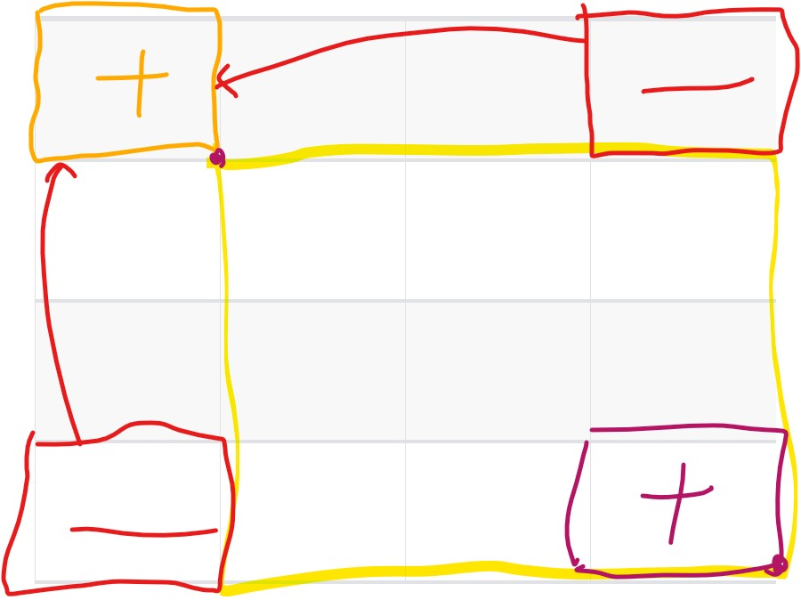

# [BaekJoon#11660] 구간 합 구하기 5

> ### Problem
>
> https://www.acmicpc.net/problem/11660

> ### Solution

```java
import java.io.BufferedReader;
import java.io.IOException;
import java.io.InputStreamReader;
import java.util.StringTokenizer;

public class Main {
    public static void main(String[] args) throws IOException {
        BufferedReader br = new BufferedReader(new InputStreamReader(System.in));
        StringBuilder result = new StringBuilder();

        StringTokenizer token = new StringTokenizer(br.readLine());
        int N = Integer.parseInt(token.nextToken());
        int M = Integer.parseInt(token.nextToken());

        int[][] square = new int[N+1][N+1];

        for(int i=1; i<=N; i++){    // 누적 합 적용
            token = new StringTokenizer(br.readLine());
            for(int j=1; j<=N; j++){
                square[i][j] = Integer.parseInt(token.nextToken());
                square[i][j] += (square[i-1][j] +square[i][j-1] - square[i-1][j-1]);
            }
        }

        while(M-- >0){
            token = new StringTokenizer(br.readLine());
            result.append(sum(square,
                    Integer.parseInt(token.nextToken()), Integer.parseInt(token.nextToken()),
                    Integer.parseInt(token.nextToken()), Integer.parseInt(token.nextToken())))
                    .append("\n");
        }

        System.out.print(result.toString());

    }
    public static int sum(int[][] square, int startX, int startY, int endX, int endY){
        int sum = 0;

        sum += square[endX][endY];
        sum -= square[startX-1][endY];
        sum -= square[endX][startY-1];
        sum += square[startX-1][startY-1];

        return sum;
    }
}
```


> #### 당연하게 실패하지만 우선 시도.. -> 시간초과

```java
import java.io.BufferedReader;
import java.io.IOException;
import java.io.InputStreamReader;
import java.util.StringTokenizer;

public class Main {
    public static void main(String[] args) throws IOException {
        BufferedReader br = new BufferedReader(new InputStreamReader(System.in));
        StringBuilder result = new StringBuilder();

        StringTokenizer token = new StringTokenizer(br.readLine());
        int N = Integer.parseInt(token.nextToken());
        int M = Integer.parseInt(token.nextToken());

        int[][] square = new int[N+1][N+1];

        for(int i=1; i<=N; i++){
            token = new StringTokenizer(br.readLine());
            for(int j=1; j<=N; j++){
                square[i][j] = Integer.parseInt(token.nextToken());
            }
        }
        while(M-- >0){
            token = new StringTokenizer(br.readLine());
            result.append(sum(square,
                    Integer.parseInt(token.nextToken()), Integer.parseInt(token.nextToken()),
                    Integer.parseInt(token.nextToken()), Integer.parseInt(token.nextToken())))
                    .append("\n");
        }

        System.out.print(result.toString());

    }
    public static int sum(int[][] square, int startX, int startY, int endX, int endY){
        int sum = 0;
        for(int i = startX; i<=endX; i++){
            for(int j = startY; j<=endY; j++){
                sum += square[i][j];
            }
        }
        return sum;
    }
}
```


---




---


```java
import java.io.BufferedReader;
import java.io.InputStreamReader;
import java.util.Arrays;
import java.util.StringTokenizer;

// https://www.acmicpc.net/problem/11659
// https://www.acmicpc.net/problem/11660
public class Main {

    public static void main(String[] args) throws Exception {
        BufferedReader br = new BufferedReader(new InputStreamReader(System.in));
        StringTokenizer token = new StringTokenizer(br.readLine());

        int N = Integer.parseInt(token.nextToken());
        int M = Integer.parseInt(token.nextToken());

        int[][] arr = new int[N+1][N+1];

        for (int i=1; i<=N; i++) {
            token = new StringTokenizer(br.readLine(), " ");
            for (int j=1; j<=N; j++) {
                arr[i][j] = Integer.parseInt(token.nextToken());
            }
        }

        for (int i=1; i<=N; i++) {
            for (int j=1; j<=N; j++) {
                arr[i][j] += (arr[i-1][j] + arr[i][j-1] - arr[i-1][j-1]);
            }
        }

        int[] xy;
        for (int i=0; i<M; i++) {
            token = new StringTokenizer(br.readLine(), " ");
            xy = new int[4];
            for (int j=0; j<4; j++) {
                xy[j] = Integer.parseInt(token.nextToken());
            }
            System.out.println(prefixSum(arr, xy[0], xy[1], xy[2], xy[3]));
        }
    }

    public static int prefixSum(int[][] arr, int startX, int startY, int endX, int endY) {
        return arr[endX][endY] - arr[startX-1][endY] - arr[endX][startY-1] + arr[startX-1][startY-1];
    }

}

```